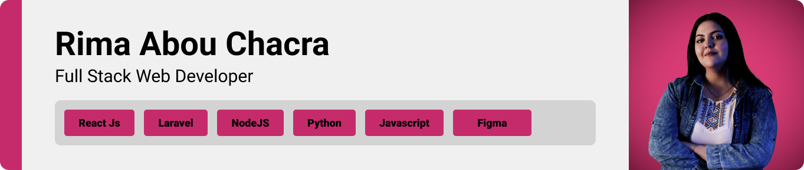

> <strong>Project Objective</strong>
>
> A Chat web app that consists of 2 screens using Angular and Laravel in order to show a Chats page (listing of chats) and a Conversation page

> I designed this page using angular for the first time, it took me some time until i reached the ideal layout for easy navigation and a seamless user experience.


### User Screens (web)

| Video  
| ---| 
|  


###  ChatApp is built using the following technologies:

- This project uses Angular for the frontend and Laravel for the backend. Angular is a popular TypeScript-based framework for building user interfaces, while Laravel is a PHP framework for web application development.
- For persistent storage, the application uses MySQL to store data.
- In terms of design, ChatApp follows a simple and modern design with a focus on usability and user experience. The application uses a minimalist color palette with a clean and easy-to-use interface.


> To set up this page, follow these steps:

### Prerequisites

This is an example of how to list things you need to use the software and how to install them.
* npm
  ```sh
  npm install npm@latest -g
  ```

### Installation

1. Clone the project repository
   ```sh
   git clone https://github.com/rimaabouchacra/Chat-app.git
   ```
3. For Angular Install NPM packages
   ```sh
   cd frontend
   npm install
   ```
3. For Laravel
   ```sh
   cd backend
   composer install
   ```   
4. Set up the database: The user needs to set up the database for the Laravel backend. The user can create a database on their local machine and update the .env file in the Laravel project with the database credentials. The .env file should be present in the backend directory.


5. Run the migrations
   ```sh
   cd backend
   php artisan migrate
   ```
6. Start the server for Laravel:

   ```sh
   cd backend
   php artisan serve
   
   ```  
6. Start the server for Angular:

   ```sh
   cd frontend
   ng serve
   
   ```    
   

Now, you should be able to run ChatApp locally and explore its features.